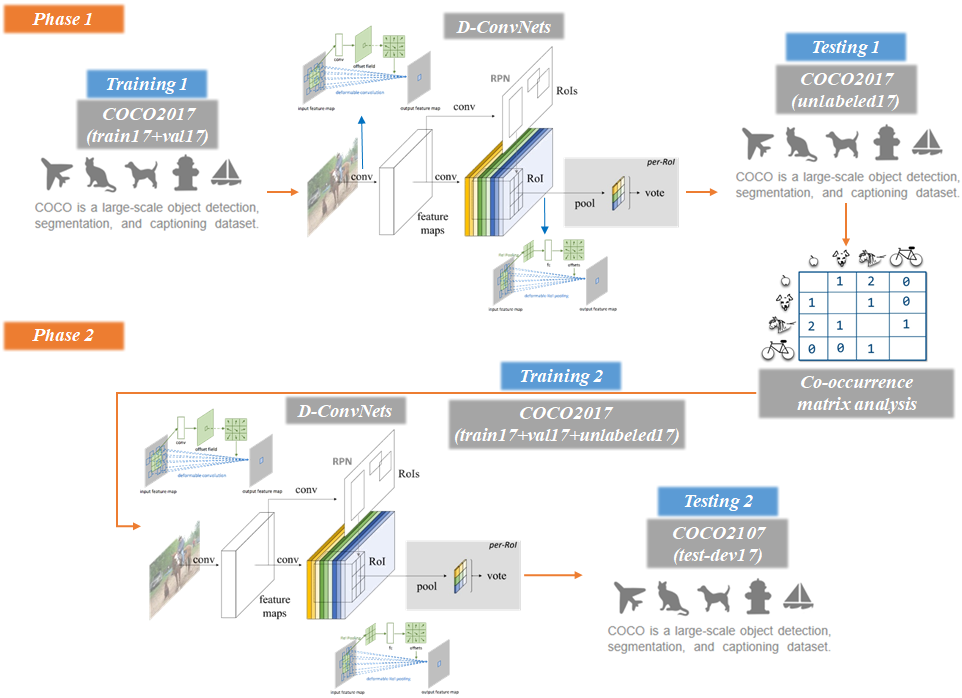
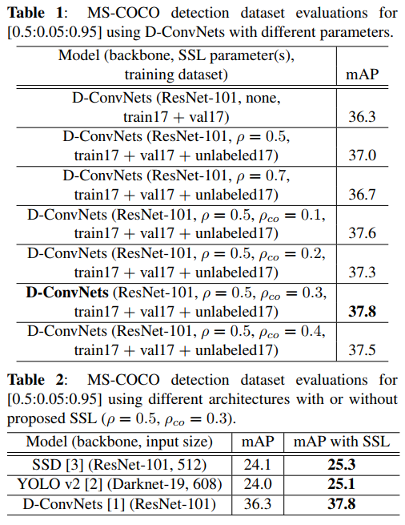

# SSL_DConvNets

## [Co-occurrence Matrix Anlaysis based Semi-Supervised Trining for Obejct Detection]

Submitted to International Conference on Image Processing (ICIP) 2018

In this paper, we propose Semi-Supervised Learning (SSL) based training methodology for object detection, which makes use of automatic labeling of un-annotated data by applying a network previously trained from annotated dataset. Since an inferred label by the trained network is usually dependent on the learned parameters, it tends to meaningless for re-training the network. To transfer valuable inferred label to the unlabeled data, we propose a re-alignment method based on co-occurrence matrix analysis that takes into account one-hot-vector encoding of the estimated label and the correlation between the objects in the image. We used MS-COCO detection dataset to verify the performance of the proposed SSL method and Deconvolutional Neural Networks (D-ConvNets) as an object detector for basic training. The performance of the existing state-of-the-art detectors (D-ConvNets, YOLO v2, and Single Shot Multi-box Detector (SSD)) can be improved by the proposed SSL method without using the additional model parameter or modifying the network architecture.

### 1. Algorithm description

1. Baseline network  - **"Deformable Convolutional Networks"**, Jifeng Dai, et al., ICCV 2017(<a href="https://arxiv.org/abs/1703.06211" target="_blank">link</a>)
2.  Modifications  - Semi-supervised training with co-occurrence matrix analysis
  
### 2. Instruction
1. Install original Deformable ConvNets from git repository (<a href="https://github.com/msracver/Deformable-ConvNets" target="_blank">link</a>)
2. Setup running environments and run demo program for DConvNets
3. Download MS-COCO Dataset from COCO website(<a href="http://cocodataset.org/#download" target="_blank">link</a>)
4. Add uncompressed COCO dataset to data folder (using symbolic link)
  >~\Deformable-ConvNets\data\coco
5. Clone repository(<a href="https://github.com/kaisarulius/SSL_DConvNets" target="_blank">link</a>), copy & overwrite, and run
    1. Trianing 1 to train baseline detector using train17+val17 
	    1. Overwrite folders in 'training1' to DConvNets folder
	    2. Run with training script
		> **Note:** If you use pre-trained network, please download from (<a href="https://drive.google.com/file/d/15-CFqF9em3y5w2QsZ92hYkWq0Fr0aIBI/view?usp=sharing"> link </a>)
	      + For baseline netowrk, please use the model in ~\output\rfcn_dcn_800_1200_10epoch

    2. Testing 1 to obtain pseudo-labeling data from unlabeled17         
	    1. Overwrite folders in 'testing1' to DConvNets folder
	    2. Run with testing script
		> **Note:** If you use pre-extracted annotation file, please download from the <a href="https://drive.google.com/file/d/1eqI2CT2AQbcdRj-AHymACKbgzU4W9JPv/view?usp=sharing" target="_blank">link</a>.
    3. Training 2 to train network with the proposed SSL method
	    1. Download co_occurrence matrix(<a href="https://drive.google.com/open?id=1HQfHdfZBRN-eWerqoyyt1Nz8LL_Yu4vw" target="_blank">link</a>)
	    2. Overwrite folders in 'training2' to DConvNets folder
	    3. Run with training script
    4. Testing 2 to obtain final results
	    1. Overwrite folders in 'testing2' to DConvNets folder
	    2. Run with testing script
	    3. Upload test-dev2017 result to CodaLab evaluation website(<a href="https://competitions.codalab.org/competitions/5181" target="_blank">link</a>)
      

### 3. Running script
> For training: python ./rfcn/train_end2end.py —cfg ./experiments/rfcn/cfgs/resnet_v1_101_coco_trainval_rfcn_dcn_end2end_ohem.yaml

> For testing: python ./rfcn/test.py —cfg ./experiments/rfcn/cfgs/resnet_v1_101_coco_trainval_rfcn_dcn_end2end_ohem.yaml

### 4. Experiment result
**Please see the paper for training details.**

